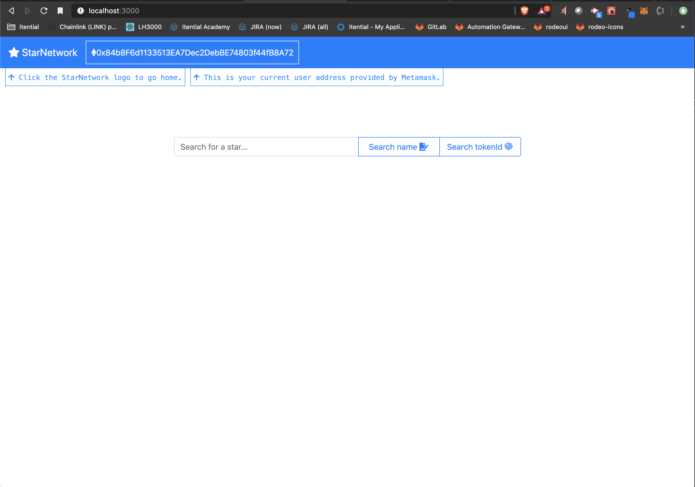
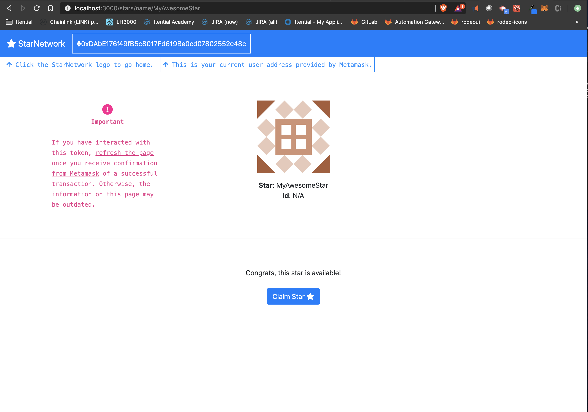
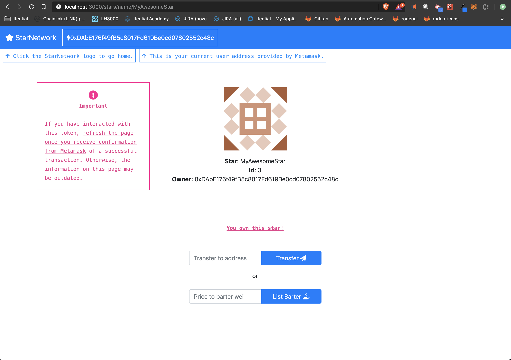
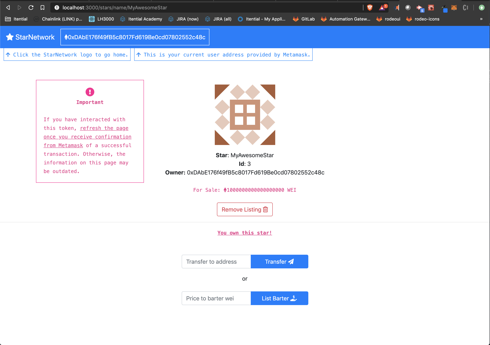
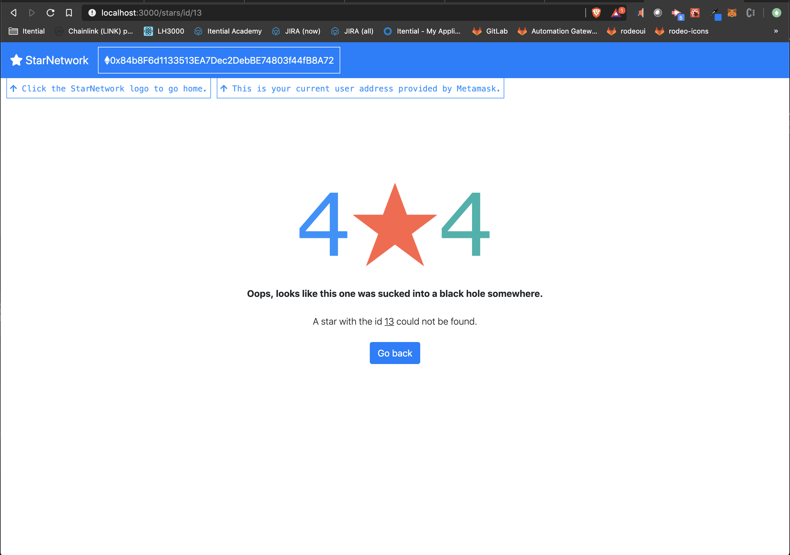

# Star Network

## Introduction

> This is the Udacity project submission 'Build CryptoStar Dapp on Ethereum' by Sameer Dewan. This project is designed to work on the Rinkeby network, but can be expanded upon to support others.

> This project utilizes Jdenticon (https://jdenticon.com/) to generate unique, one of a kind stars you truly feel you own (and in essense, do own!).

## Installation

> This project utilizes create-react-app. To run the client, ``cd client``, run ``npm install`` and then ``npm start``. To test the contract code, in the main directory run ``truffle develop`` and then in the truffle console, run ``test``.

> Metamask must be installed.

> Truffle v5.1.26 (core: 5.1.26)
> Solidity - ^0.6.0 (solc-js)
> Node v10.16.3
> Web3.js v1.2.1
> @truffle/hdwallet-provider - 1.0.35
> @openzeppelin/contracts - 3.0.1

> Contract https://rinkeby.etherscan.io/address/0x4cb644a1d070a42f49599923dd09a05c158f51d5
> Token Tracker https://rinkeby.etherscan.io/token/0x4cb644a1d070a42f49599923dd09a05c158f51d5

## How can I test out this cool application??

> To test, try using two users who can trade, transfer, and sell stars to each other. https://faucet.rinkeby.io/ is a good place to go to get test network ether for this purpose, to fill both accounts. I recommend sending enough ether to one address, and then from Metamask transfer half to the second account address, as Rinkeby Faucet will place a limit on the amount of ether you can receive a day.

## Features

> This project will allow you to search for a star by name and id. From the user interface, you will be able to search for a star and if it is not yet claimed, claim it. You can exchange your stars with others who have put up their own stars for barter, or buy them at the asked price. You can also transfer a star to another address. It is important to note that if you buy a star, you must spend the value asked + a bit extra for the contract to acknowedge the request. You will be refunded the difference. Gas costs vary, so if your transaction does not go through, a best course of action is to increment your gas expenditure. These options are left to the user in the interface to make their best judgement calls and experiment with what the Rinkeby network will acknowledge. 

